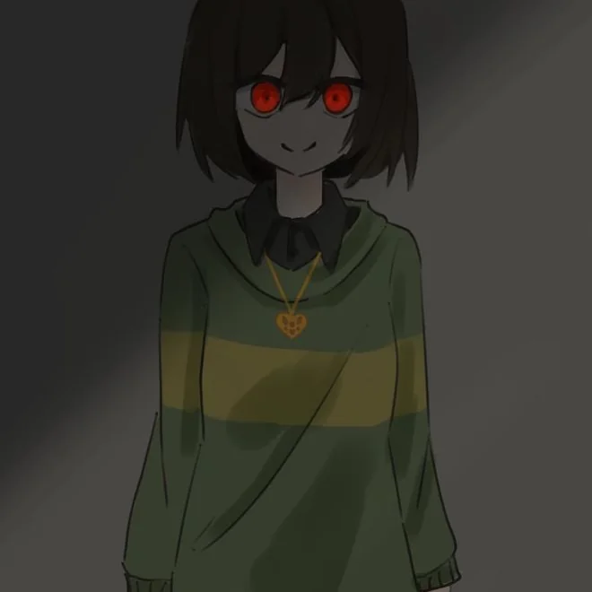
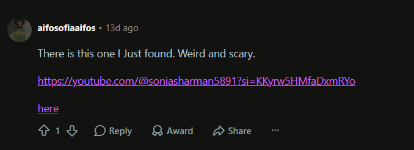
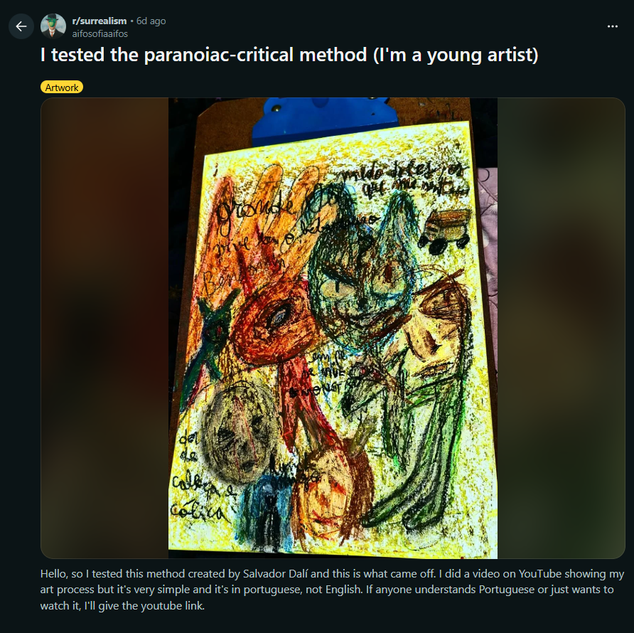
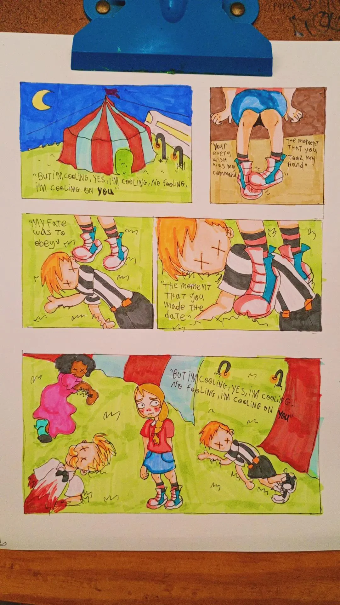

# Sonia Sharman Investigation Notes

## Objective

Collect, organize, and analyze all discovered ARG information.

## Rules

* Every clue, code, image description, URL, username, timestamp, file, cipher, or theory gets logged.
* Morse code will be translated and documented.
* Potential meanings, links between clues, and unresolved mysteries will be tracked.
* Information stays organized chronologically and by category.

## Quick Index

### Primary Account

* YouTube: Sonia Sharman / `@soniasharman5891`

### Discovery Order Sources

* Source 001: YouTube channel, joined 11.10.2020
* Source 002: Video, posted 22.10.2020, `I DIDNT WANT TO KILL HER, BUT`
* Source 003: Video, posted 23.10.2020, Portuguese title / Maycon message
* Source 004: Video, posted 08.11.2020, `How to commit a happy suicide`
* Source 005: YouTube Short, posted 22.10.2020, likely `I HATE HER`
* Source 006: YouTube Short, posted 22.10.2020, `MY REGRET IS THAT I KILLED MY GI`
* Source 007: YouTube Short/Reel, posted 22.10.2020, `HAHAHAHAHAHA`
* Source 008: Video, posted 23.10.2020, `IM GOING TO GO CRAZY WITHOUT L`

### Tracked Names / Entities

* Sonia Sharman: channel identity / possible narrator identity.
* Maycon: named in hidden Morse; relationship unknown.
* Lucy: Sonia's girlfriend, described as beloved; Sonia claims Lucy was killed after witnessing Ratchel's death.
* Ratchel / Harley Ratchel / HR: identified in comments as Sonia's cousin and murder victim; Sonia claims Ratchel bullied and outed her.
* "Her": recurring female target/victim reference; may refer to Ratchel or Lucy depending on context.
* "Them": mentioned in the channel description; unclear whether this refers to viewers, police, bullies, or another group.

### Commenters / Related Accounts

* `@selection1445`: asks several in-universe questions about Ratchel, Lucy, the police, and the car; has a related-looking YouTube video titled `leaving`.
* `@juliettedebackere9599` / Isaac Debackere: asks about Sonia's crash and notices a date contradiction.
* `@beckyginger782`: comments on Lucy and asks Sonia to stop communicating only in Morse; account joined 23.10.2020.
* `u/aifosofiaaifos`: Reddit user who appears to have posted/found the Sonia Sharman channel; possible but unconfirmed ARG connection.

### Recurring Patterns

* Morse code in titles, descriptions, on-screen text, and audio.
* Malformed Morse or missing letters.
* Violent confession/threat language.
* Flickering lights, darkness, unstable camera movement, VHS/glitch aesthetics.
* Childlike/cute imagery contrasted with violence.
* Blood imagery and possible aftermath evidence.
* Romantic/relationship language mixed with murder confession.

### Open Questions

* Who is Maycon?
* When does "her" refer to Ratchel, and when does it refer to Lucy?
* Who are "them" in `I WANT THEM TO CATCH ME`?
* Are the malformed Morse errors accidental, intentional, or part of another cipher layer?
* What was the planned wedding/relationship referenced in Source 006?
* What is the significance of the car in the grass field at the end of Source 006?
* Is the blood shown in Source 004 and Source 006 staged, symbolic, or connected to earlier events?
* Why does Sonia claim the date is June 4th, 2018 while the YouTube activity is from October 2020?
* Do other YouTube accounts interact with Sonia Sharman in a way that is part of the ARG?
* Is `@selection1445` part of the ARG or only an engaged viewer?
* Is `@juliettedebackere9599` / Isaac Debackere part of the ARG or only an engaged viewer?
* Is `@beckyginger782` part of the ARG or only an engaged viewer?
* Is `u/aifosofiaaifos` connected to the ARG creator, or are the Portuguese/Chinese/profile-image overlaps coincidental?
* What exactly is shown on the white blood-covered surface in Source 007?

### Future Source Structure

From this point onward, append new findings in discovery order unless explicitly asked to reorganize or insert them elsewhere. The Quick Index may still be updated so important people, accounts, and unresolved questions remain easy to find.

## Evidence Log

### Timeline Structure

Evidence is documented in discovery order from this point onward unless a section explicitly says otherwise.

### Source 001 — YouTube Channel

* Platform: YouTube
* Channel Name: Sonia Sharman
* Handle: `@soniasharman5891`
* Joined: 11.10.2020

#### Channel Description (Original Morse)

```text
.. / .-- .- -. - / - .... . -- / - --- / -.-. .- - -.-. .... / -- . --..-- / ..-. --- .-. / -. --- .-- / - .... .. ... / .. ... / .--- ..- ... - / .- / .--- --- -.- .
```

#### Morse Translation

```text
I WANT THEM TO CATCH ME, FOR NOW THIS IS JUST A JOKE
```

#### Initial Interpretation

* The creator wants to be noticed or "found".
* "For now this is just a joke" could imply:

  * the ARG starts harmlessly before escalating
  * misdirection to make viewers underestimate it
  * possible in-universe denial/plausible deniability
* Tone feels intentionally cryptic and attention-seeking.

---

### Source 002 — Video Upload

* Type: YouTube Video
* Posted: 22.10.2020
* Comments: None

#### Video Title (Original Morse)

```text
.. / -.. .. -.. -. - / .-- .- -. - / - --- / -.- .. .-.. .-.. / .... . .-. --..-- / -... ..- - /
```

#### Title Translation

```text
I DIDNT WANT TO KILL HER, BUT
```

#### Video Description (Original)

```text
.. / .-.. -- ... . .. / - .... . - / -. .. .-. .-.. --..- / ... .. - / ... .... . / ... .- .-- / .-- .... .- - / .. / .. .. -.. / - -- / - -.- / .-. -- ..- ... .. . .-.-. / .. / .-. .-. .. . -.. / ... -- / - .. .-. .... / . ..-. - . .-. / .. / . .. .-.. .-.. . .. / .... . .-. .-.-.
```

#### Description Analysis

Literal Morse decoding result:

```text
I LMSEI THET NIRL? SIT SHE SAW WHAT I IID TM TK RMUSIE? I RRIED SM TIRH EFTER I EILLEI HER?
```

Analysis:

* The Morse groups appear malformed or mistyped.
* The output does not form clean English.
* Possible reasons:

  * incorrect dots/dashes
  * inconsistent spacing between letters or words
  * intentional scrambling
  * mixed/stacked cipher
  * partial corruption

Potential recognizable fragments:

```text
“SHE SAW WHAT I DID…”
“AFTER I KILLED HER?”
```

The message currently does not fully decode into valid English and likely requires either correction or an additional decoding layer.

#### Visual/Audio Observations

* Strange unsettling music throughout.
* A room is visible with flickering lights.
* Near the end:

  * the room suddenly turns dark
  * appears as if a light switch was turned off
  * a strange white-and-black silhouette appears

#### Silhouette Description

Possible interpretations:

* skull-like shape
* banana-shaped object
* knife/blade silhouette
* abstract entity or mask

#### Narrative/Theory Notes

The title strongly implies:

* a murder or accidental killing
* possible guilt/confession narrative
* continuation from the channel description's darker undertones

The flickering room and final silhouette may symbolize:

* the victim
* the killer
* a supernatural entity
* psychological breakdown/hallucination
* a visual signature/icon recurring later in the ARG

---
### Source 003 — Video Upload

* Type: YouTube Video
* Posted: 23.10.2020

#### Video Title (Original Morse)

```text
.- .-. .-. ..- -- .- -. -.. --- / -- .. -. .... .- ... / -.-. --- .. ... .- ... / .--. .- .-. .- / .
```

#### Literal Morse Translation

```text
ARRUMANDO MINHAS COISAS PARA E
```

#### Language Observation

* This appears to be Portuguese.
* "Arrumando minhas coisas" roughly translates to:

  * "Packing my things"
  * or "Organizing my things"
* The final "E" suggests the sentence is incomplete or cut off.

#### Video Description (Original Morse)

```text
- .- -.- .-. -- . / .- .. .-.. .-.. / - .- . . / - . / - --- / .- -. -- - .... . .-. / .-. .. - -.- .-.-.- / .. / .-- .. .-.. .-.. / .-.. .. ...- . / .- .-.. -- -. . .-.-. / - .... . / .--. -- .-.. .. -.-. . / . .-. . / .-.. -- --- -. .. . --. / ..-. -- .-. / .-.. ..- .-. -.- / ... .. - / . -- / -- -. . / .... . ... / - .. ... ... . -.. / .... . .-. .-.. . .- / .- . - .-.-.- / ..-. .-. -- -- / - --- -- --- .-. .-. -- .-- / .. / .-- .. .-.. .-.. / .-. . .-. -- .-. .. / -- -.-
```

#### Description Analysis

Literal Morse decoding result:

```text
TAKRME AILL TAEE TE TO ANMTHER RITK. I WILL LIVE ALMNE? THE PMLICE ERE LMONIEG FMR LURK SIT EM MNE HES TISSED HERLEA AET. FRMM TOMORRMW I WILL RERMRI MK
```

This appears corrupted but more readable than Source 002.

Likely intended/corrected fragments:

```text
TAKRME        → TAKE ME / TAKE? ME?
AILL          → WILL / ALL
TAEE          → TAKE
ANMTHER       → ANOTHER
RITK          → RISK / RICK / CITY? unclear
ALMNE         → ALONE
PMLICE        → POLICE
ERE           → ARE
LMONIEG       → LOOKING
FMR           → FOR
FRMM          → FROM
TOMORRMW      → TOMORROW
```

Strongest readable reconstruction:

```text
[TAKE ME / ?] [WILL/ALL] [TAKE] [ME/THE?] TO ANOTHER [RISK/PLACE?].
I WILL LIVE ALONE? THE POLICE ARE LOOKING FOR [LURK?], BUT NO ONE HAS [???] HER [YET?].
FROM TOMORROW I WILL [REMORI/RECORD/RETURN?] [ME/MK?]
```

Possible narrative interpretation:

* The speaker may be preparing to leave or hide.
* This fits the Portuguese title: "Arrumando minhas coisas..." = "Packing/organizing my things..."
* The line about police suggests the speaker is either wanted, being investigated, or hiding evidence.
* "I WILL LIVE ALONE" suggests isolation after the event.
* "FROM TOMORROW" implies a planned next phase.

Recurring Morse corruption patterns:

* `M` often appears where `O` is likely intended:

  * `PMLICE` → `POLICE`
  * `FMR` → `FOR`
  * `FRMM` → `FROM`
  * `TOMORRMW` → `TOMORROW`
  * `ALMNE` → `ALONE`
* Some letters are close in Morse and may be mistyped:

  * `E` (`.`) vs `A` (`.-`)
  * `M` (`--`) vs `O` (`---`)
  * `K` (`-.-`) vs `C` (`-.-.`)
  * `R` (`.-.`) vs `E` (`.`) if extra strokes were added

Working theory:
The ARG creator may be intentionally simulating panic, bad transcription, a damaged signal, or unreliable narration through broken Morse.

#### Visual Observations

* Vertical VHS-style effect.
* Camera points at a ceiling/light.
* Light repeatedly turns on and off.
* Bells suddenly ring.
* Footsteps or movement sounds can be heard.
* Mosquito/high-pitched buzzing sound present.
* Camera repeatedly zooms in and out.
* At one point it appears the camera falls or is dropped.

#### Hidden Text Appearing In Video

Original Morse shown onscreen:

```text
-- .- -.-- -.-. --- -. / .- -. -.. / .. / -.. . -.-. .. -.. . -.. / - .... .- -/ .-- . / .-- .. .-.. .-.. / -.- .. .-.. .-.. / . ...- . .-. -.-- --- -. . / .-- .... --- / -... ..- .-.. .-.. .. . -.. / -- .
```

#### Hidden Text Translation

```text
MAYCON AND I DECIDED THAT WE WILL KILL EVERYONE WHO BULLIED ME
```

#### Maycon Reference

* Name introduced: "Maycon"
* Likely:

  * accomplice
  * friend
  * alternate personality
  * co-conspirator

#### Hidden Audio Message

After around 1:58, a strange repeating TTS-like voice can be heard while the camera continues zooming in and out. The audio was difficult to figure out and initially sounded like nonsense or Mandarin.

Heard/transcribed chant:

```text
"don donki don donki don don donki donki don don don donki shi gonki don donki donki en pien shen donki en pien shen don donki"
```

Reddit user `Puzzleheaded_Room750` helped identify that the audio likely used Chinese TTS reading Morse notation symbols:

* 點 (`diǎn`) = dot (`.`)
* 槓 (`gàng`) = dash (`-`)
* 斜 (`xié`) = slash (`/`)

These spoken words were transformed back into Morse symbols. The raw Morse extracted from the audio appeared malformed and lacked proper spacing:

```text
--.--.---.-.----./-.--.-../-../--...-.-...-...-../--.....--/-.--./-
.--...-...-../--.-...-...-../-....-..-.-.------../-.--....---/--.....-
.-...-.....-../---.
```

A pattern was discovered where an extra dash (`-`) appeared after many separators/slashes. After correcting for this and restoring spacing, the message decoded cleanly.

Reconstructed Morse:

```text
-- .- -.-- -.-. --- -. / .- -. -.. / .. / -.. . -.-. .. -.. . -.. /
- .... .- - / .-- . / .-- .. .-.. .-.. / -.- .. .-.. .-.. /
. ...- . .-. -.-- --- -. . / .-- .... --- /
-... ..- .-.. .-.. .. . -.. / -- .
```

Decoded message:

```text
MAYCON AND I DECIDED THAT WE WILL KILL EVERYONE WHO BULLIED ME.
```

Important note:

* Final interpretation determined that the first word is:

```text
-- .- -.-- -.-. --- -. = MAYCON
```

* `Maycon` aligns with the raw Morse sequence and with the visible on-screen Morse from the same video:

```text
-- .- -.-- -.-. --- -. 
```

which resolves to `MAYCON`.

#### Maycon Reference

* Maycon had already appeared in the visible on-screen Morse from this video.
* Unknown whether Maycon is:

  * a real person
  * online alias
  * alternate personality
  * nickname/codename
  * someone known to the protagonist

#### Additional Notes

* Camera eventually returns to original position.
* Background person/noise is audible but unclear.
* Glitches increase after the threatening message appears.
* Recurring motifs now include:

  * flickering lights
  * unstable camera movement
  * corrupted Morse
  * violent confessions/threats
  * VHS analog horror aesthetics

---

### Source 004 — Video Upload

* Type: YouTube Video
* Posted: 08.11.2020
* Title: `How to commit a happy suicide`
* Description:

```text
It's very easy, and practical and cute 0
```

* Comments: 2 comments, both appear to be real viewer comments and likely not part of the ARG.
* Captions: None observed.
* Audio: No special sound or notable hidden audio observed.

#### Visual Observations

* The video opens on a small kitchen knife and a Minions sticker.
* The person takes a pen and writes on the knife.
* The writing is barely visible, but based on the hand movement it appears to be:

```text
Hi
<3
```

* The person closes the pen.
* The person opens the Minions sticker.
* For a brief second, a floor with blood is visible.
* The person wraps the Minions sticker around the knife handle.
* The decorated knife is then shown off to the camera.

#### Object Notes

* Kitchen knife: continues the violent/self-harm imagery.
* Minions sticker: childish/cute visual contrast against the knife and blood.
* "Hi" and heart: possibly mocking, intimate, or performatively playful.
* Blood glimpse: important frame, may indicate aftermath of prior violence or staged evidence.

#### Interpretation Notes

* The title and description use a cheerful/cute tone while showing a knife and a brief blood image.
* This contrast may be intentional tonal dissonance: childlike decoration placed onto a weapon.
* The Minions sticker could be:

  * random absurdist humor
  * a personal signature
  * an attempt to make violence look harmless or "cute"
  * a clue if Minions imagery recurs later
* The brief blood-frame may be the most important visual clue in this upload and should be checked frame-by-frame if possible.

---

### Source 005 — YouTube Short

* Type: YouTube Short
* Posted: 22.10.2020
* Comments: None

#### Short Title (Original Morse-Like Symbols)

```text
•• •••• •- - • •••• •-•
```

#### Title Translation

```text
IHATEHR
```

#### Title Analysis

* The title uses bullet symbols (`•`) as dots and hyphens (`-`) as dashes.
* Literal decoding gives `IHATEHR`.
* This is likely intended to read:

```text
I HATE HER
```

* The expected `E` before `R` appears to be missing, matching the recurring pattern of malformed or incomplete Morse.

#### Short Description (Original Morse-Like Symbols)

```text
•-• • •- •-•• •-•• •-
```

#### Description Translation

```text
REALLA
```

#### Description Analysis

* Literal decoding gives `REALLA`.
* This may be a malformed version of:

```text
REALLY
```

* If so, the title and description together may imply:

```text
I HATE HER REALLY
```

or more naturally:

```text
I REALLY HATE HER
```

#### Visual/Audio Observations

* The video appears to be a phone recording of a staircase going upstairs.
* The camera seems to be hiding or peeking upward from below.
* Footsteps or similar sounds can be heard.
* The room is dark and only illuminated by flashlight.
* No other special sound or obvious visual event was noted.

#### Hidden Message

Hidden signs appear in the short and seem to form Morse:

```text
- .-. .- .. - --- .-.
```

Decoded message:

```text
TRAITOR
```

#### Interpretation Notes

* `TRAITOR` may refer to the unnamed "her", Maycon, the narrator, or someone involved in the bullying/revenge thread.
* The hiding/peeking camera perspective may imply stalking, fear, surveillance, or following someone upstairs.
* This source strengthens the emotional motive around hatred, betrayal, and a specific female target.

---

### Source 006 — YouTube Short

* Type: YouTube Short
* Posted: 22.10.2020
* Placement: Investigated after Source 005.
* Comments: Not specified.

#### Short Title (Original Morse)

```text
-- -.-- / .-. . --. .-. . - / .. ... / - .... .- - / .. / -.- .. .-.. .-.. . -.. / -- -.-- / --. ..
```

#### Title Translation

```text
MY REGRET IS THAT I KILLED MY GI
```

#### Title Analysis

* The title decodes mostly cleanly but appears cut off at the end.
* `MY GI` is likely the beginning of `MY GIRL`, `MY GIRLFRIEND`, or another word beginning with `GI`.
* Since the phrase already says `KILLED MY...`, the incomplete ending may be intentional truncation or another malformed Morse error.

#### Short Description (Original Morse)

```text
.-- . / .-- . .-. . / .--. .-.. .- . -. .. -. --. / -- ..- .-. / .-- . .. -.. .. -. --. / ... -- - . - .. -- . / .- .... . . / .- . / -. -- - / -- .-.. -.. . .-. --..-- / ... .. - / - .... .- - / ... .. - -.-. .... / -. . - . -.. / .... . .-. .-.. . .- / .... .- .. / - -- / ... .... -- .-- / .. .--. / - -- / ... -.-. .-. . .- / .. - / ..- .--. .-.-.- / .. / .. -- . - / .-. . --. .-. . - / -. .. .-.. .-.. .. -. --. / .... . .-.
```

#### Description Translation

Literal Morse decoding result:

```text
WE WERE PLAENING MUR WEIDING SMTETIME AHEE AE NMT MLDER, SIT THAT SITCH NETED HERLEA HAI TM SHMW IP TM SCREA IT UP. I IMET REGRET NILLING HER
```

#### Description Analysis

The description is heavily malformed, but several fragments are recognizable:

```text
WE WERE [PLANNING] [OUR] [WEDDING] SOMETIME ...
... NOT OLDER ...
... THAT [BITCH] ...
... TO SHOW UP TO SCREW IT UP.
I [MOST / ...] REGRET [KILLING] HER
```

Possible intended meaning:

```text
WE WERE PLANNING OUR WEDDING SOMETIME ...
... BUT THAT BITCH ... HAD TO SHOW UP TO SCREW IT UP.
I ... REGRET KILLING HER.
```

Unclear points:

* `PLAENING` likely means `PLANNING`.
* `MUR` likely means `OUR`.
* `WEIDING` likely means `WEDDING`.
* `SMTETIME` likely means `SOMETIME`.
* `SITCH` may be intended as `BITCH`.
* `NILLING` likely means `KILLING`.
* The middle sentence is too corrupted to reconstruct safely.

#### Visual/Audio Observations

* The camera films three tissues covered with blood.
* There is static background buzzing.
* A recurring high-pitched beep can be heard.
* At the end, a car standing in a grass field with open doors is visible for a short moment.

#### Interpretation Notes

* This short may connect the unnamed "her" to a romantic relationship or wedding plan.
* The blood-covered tissues reinforce that the violent imagery may be tied to an aftermath scene.
* The final car shot may be important and should be checked frame-by-frame if possible.
* The title and description both point toward regret after killing someone, but the exact relationship remains unclear.

#### Comment Threads

Only translated Sonia comments are logged here. Original Morse versions are intentionally omitted for readability.

##### Thread 1 — `@selection1445`

`@selection1445` asks whether the blood belongs to Ratchel or Sonia's girlfriend.

Sonia replies:

```text
THAT BITCH COULD NEVER HAVE BLOOD AS PURE AS LUCYS
```

`@selection1445` asks whether Harley Ratchel did something that could justify the crime.

Sonia replies:

```text
IF BULLYING IS A CRIME, I WAS DEFENDING MYSELF, AND IF I WAS DEFENDING MYSELF IT IS A GOOD JUSTIFICATION. COME ON, IM ONLY 14, WHAT ARE THEY GOING TO DO TO ME?
```

`@selection1445` suggests Sonia should call the police and asks why Ratchel outed her at school.

Sonia replies:

```text
SHE WAS JEALOUS OF ME BECAUSE I GOT BETTER GRADES AND GOT MORE ATTENTION FROM MY PARENTS THAN SHE DID. SHE HAS BEEN TORMENTING ME EVER SINCE AND WHEN SHE FOUND OUT ABOUT MY GIRLFRIEND SHE TOLD THE WHOLE SCHOOL. WHEN I ARRIVED AT SCHOOL EVERYONE CALED ME ABSURD THINGS. AT THE END OF CLASS WHILE I WAS GOING TO LUCYS HOUSE SHE CAME TO PISS ME OFF. SO I KILLED HER BUT LUCY HEARD ME SCREAMING AND WHEN SHE SAW WHAT I DID I HAD TO KILL HER
```

`@selection1445` asks whether Sonia had thought about killing her cousin before and whether Sonia needs help.

Sonia replies:

```text
I WANTED TO KILL HER FOR A LONG TIME. I TOLD LUCY AND SHE HELPED ME BY GIVING ME THE PILLS FOR HER ANXIETY AND DEPRESSION. SHE WAS SO KIND TO ME! IT HELPED ME A LOT BUT ON THAT DAY HER REMEDIES RAN OUT SINCE WE WERE BOTH TAKING THE PILLS. I HAD NOT SEEN ALL DAY AND WHEN I LEFT SCHOOL I JUST WANTED TO HEAR YOUR VOICE. I JUST DIDNT THINK THAT INSTEAD OF THAT SWEET VOICE I WOULD HEAR YOUR SCREAMS
```

##### Thread 2 — Sonia, `@selection1445`, and `@juliettedebackere9599`

Sonia comments:

```text
SHE WAS SUCH A SWEET GIRL. I WOULD MAKE ALL THE SACRIFICES FOR HER. BUT I DIDNT WANT HER TO BE AFRAID OF ME. NOW SHE IS IN HEAVEN, AND I AM HERE CRYING TO SEE HER BODY UNDER MY BED. WHY IS NO ONE LOOKING FOR HER?
```

`@selection1445` tells Sonia not to hide Ratchel's corpse under her bed and says she should call the police.

Sonia replies:

```text
I BURNED RATCHELS BODY, I DONT CARE ABOUT HER. THE CORPSE UNDER MY BED BELONGS TO MY BELOVED LUCY, AND I WILL NEVER HAND IT OVER TO THE POLICE, SLEEPING WITH LUCY BY MY SIDE IS THE ONLY THING THAT COMFORTS ME
```

`@selection1445` asks whether Sonia drove Ratchel's corpse into the middle of nowhere and burned it, and asks whether the car belongs to HR, Lucy, Sonia's parents, or someone else.

Sonia replies:

```text
I DONT CARE ABOUT ANSWERING QUESTIONS, I LIKE IT BECAUSE I FEEL LIKE I HAVE FRIENDS. I SET HER CAR ON FIRE WITH HER BODY IN IT, I DROVE INTO THE MIDDLE OF NOWHERE AND CRASHED 3 TIMES LOL I WOULD GIVE ANYTHING TO SEE HER CAR BURNING AGAIN, THE SMELL WAS REALLY WEIRD
```

`@juliettedebackere9599` asks whether Sonia is okay after crashing three times.

Sonia replies:

```text
I DIDNT GET HURT TOO MUCH, BECAUSE I HAD ALREADY DRIVEN WITH MY FATHER BEFORE, HE TAUGHT ME. SINCE THE JUNE VACATION IS ABOUT TO START AND THERE WILL BE NO ONE AT HOME BUT ME, NO ONE WILL MISS HR BECAUSE SHE CAME TO SPEND THE HOLIDAYS WITH ME (BUT I DIDN WANT TO)
```

`@juliettedebackere9599` notices a contradiction: Sonia mentions June vacation, but the visible upload/comment context is October.

Sonia replies:

```text
NO, ITS JUNE, THE HOLIDAYS HAVE JUST STARTED
```

`@juliettedebackere9599` asks for the exact date and time.

Sonia replies:

```text
OF COURSE. ITS 159 PM, JUNE 4TH
```

Sonia adds:

```text
THE YEAR IS 2018. I THINK YOU ARE LOST LITTLE FRIEND LOL
```

`@juliettedebackere9599` says that for them it is 7 PM in France, but the date is October 23.

#### Comment Thread Notes

* New in-story names: Lucy and Ratchel / Harley Ratchel / HR.
* Sonia claims she is 14.
* Sonia claims Ratchel was her cousin.
* Sonia claims Lucy was her girlfriend.
* Sonia claims Ratchel outed her relationship at school.
* Sonia claims she killed Ratchel first, then killed Lucy because Lucy saw what happened.
* Sonia claims Ratchel's body was burned in a car in the middle of nowhere.
* Sonia claims Lucy's body is under her bed.
* The brief car image at the end of the short may connect directly to the comment about burning Ratchel's body in a car.
* Major timeline contradiction: upload/comment context is October 2020, but Sonia claims the current date is June 4th, 2018 at 1:59 PM.

## Related Account Findings

These notes cover accounts that interact with or may be connected to the Sonia Sharman ARG. Connection strength varies and should be treated cautiously unless confirmed by later clues.

### YouTube Account — `@selection1445`

* Profile picture: mountain.
* Channel banner: frog.
* Account created: 02.07.2018.
* Known activity connected to Sonia Sharman:

  * Commented on Source 006.
  * Asked direct in-universe questions about Ratchel, Lucy, the police, the car, and possible motives.

#### Uploaded Video

* Title: `leaving`
* Uploaded: 07.06.2022
* Description:

```text
can't write for too long theyre near im leaving the house explain later !@@!!
```

Visual/audio observations:

* Phone video with mostly black screen.
* Someone can be heard walking and breathing quickly.
* Outdoor ambience includes insects and footsteps on a path.
* Around 0:32, the camera angle lifts and briefly shows a house in the distance.
* It is nighttime, but lights are still on in the house.
* The camera is lowered again.
* Breathing gets heavier, possibly because the person starts running.
* The person appears to reach or move onto a street.
* No other notable clues observed yet.

Interpretation notes:

* The title and description imply fleeing or being followed.
* Because this video was uploaded much later than the Sonia Sharman uploads, it could be a later ARG extension, a separate project, or unrelated viewer content.

### YouTube Account — `@juliettedebackere9599` / Isaac Debackere

* Display name: Isaac Debackere.
* Account created: 08.06.2014.
* Profile description:

```text
.Subscribe to Pewdiepie and SQUEEZIE. thanks.
```

* A contact email is listed on the account. The investigator has written to ask whether they would answer questions.
* Known activity connected to Sonia Sharman:

  * Commented on Source 006.
  * Asked whether Sonia was hurt after crashing.
  * Noticed the June/October date contradiction.
  * Asked Sonia for the exact date and time.

#### Profile Image Note


Observed profile image:

* Drawing of a girl/person with shoulder-length slightly wavy brown hair.
* Glasses.
* Green off-shoulder top.

Potential relevance:

* The image has a loose visual similarity to `u/aifosofiaaifos`'s profile image, mainly brown hair and green clothing.
* This is not enough to prove a connection.

### Reddit Account — `u/aifosofiaaifos`

* Reddit account age: about 5 years.
* Karma/contributions observed by investigator:

  * about 2.3k karma
  * 335 contributions
  * account activity not directly visible because the profile is private/restricted

Known/observed relevance:

* Appears to have posted or surfaced the Sonia Sharman channel on Reddit.
* A Google search for `aifosofiaaifos site:reddit.com` shows older posts that may still be indexed.
* The account may be unrelated, an ARG discoverer, or potentially the ARG creator. Status: unconfirmed.

#### Local Evidence Images

Profile image:



Reddit ARG/channel mention screenshot:



Chinese/Backrooms search result screenshot:


Surrealism/Portuguese art post screenshot:



Comic image screenshot:



#### Profile Image Note

Observed profile image:

* Drawing of a figure with shoulder-length brown hair.
* Red eyes.
* Green/yellow striped top.
* No glasses visible.

Possible connection:

* Loose similarity to Isaac Debackere / `@juliettedebackere9599` profile image: brown hair and green clothing.
* Differences: red eyes, darker tone, no glasses, different art style.
* Treat as possible visual overlap, not proof.

#### Indexed Reddit Findings

Google-indexed posts connected to `u/aifosofiaaifos` include:

* A post introducing herself as Sofia and mentioning Angry Birds.
* A comic post using lyrics from `I'm Coolin', No Foolin'` by Lesley Gore.
* A surrealism post titled:

```text
I tested the paranoiac-critical method (I'm a young artist)
```

The surrealism post description says the creator made a YouTube art-process video in Portuguese. This may be relevant because earlier Sonia Sharman clues include Portuguese text.

Another indexed post appears on `r/backrooms` with the title:

```text
逃离“乐趣”层?
```

Possible relevance:

* The Chinese title may be notable because the Sonia Sharman ARG used Chinese TTS words to encode Morse symbols.
* The Portuguese YouTube/art-process mention may be notable because Source 003 has a Portuguese Morse title.
* These overlaps are interesting but still circumstantial.

#### ARG Reddit Post Lead

Google search also surfaces this Reddit ARG post:

```text
https://www.reddit.com/r/ARG/comments/1sxyfep/sonia_sharman_bizarre_youtube_arg/?tl=de
```

Possible significance:

* May have been posted by `u/aifosofiaaifos`, or may simply appear in search results because the account commented or was indexed nearby.
* Needs verification before treating it as connected.

---

### Source 007 — YouTube Short/Reel

* Type: YouTube Short/Reel
* Posted: 22.10.2020

#### Title

Original Morse:

```text
.... .- .... .- .... .- .... .- .... .- .... .-
```

Decoded title:

```text
HAHAHAHAHAHA
```

#### Description

Original Morse:

```text
.... .- .-.. . .- / .-. .- - .-. .... . .-...... . .-.. . .- / .-. .- - -.-. .... . .-..
```

Literal decode:

```text
HALEA RATRHE?ELEA RATCHEL
```

Description analysis:

* The description is malformed.
* `RATCHEL` is clearly present at the end.
* The earlier corrupted fragments may also be attempts to write `Ratchel`, but this is uncertain.

#### Visual/Audio Observations

* Blood is visible on a white surface.
* The exact object or surface is unclear.
* A bark-like sound can be heard at the start.
* Near the end, someone appears to be whining.

#### Comments

Only translated Morse comments are logged here for readability.

`@juliettedebackere9599` asks:

```text
Why did you do that?
```

Sonia replies:

```text
THAT BITCH TOLD MY SEXUALITY TO THE WHOLE SCHOOL
```

`@juliettedebackere9599` replies in Morse:

```text
DAMN, THAT WASN'T NICE AT ALL. ARE YOU OKAY?
```

Sonia replies:

```text
I HAVE BEEN FEELING DEPRESSED SINCE THE MURDER OF MY LUCY. NO ONE DESERVED HEAVEN MORE THAN SHE DID. BEFORE I WANTED HER TO BE SAFE, BUT I NEVER IMAGINED SHE WOULD BE AS SAFE AS SHE IS NOW, IN THE CLOUDS
```

`@juliettedebackere9599` asks:

```text
I hope that you will get better soon. How was Lucy? How did you two meet?
```

Sonia replies:

```text
SHE WAS AN INCREDIBLE GIRL. SHE HELPED ME SO MUCH. WE MET AT AN ANIME EVENT. I HAD TO KILL HER AFTER SHE SAW ME KILLING RATCHEL. SHE WAS SO SCARED. EVERY DAY I HAVE NIGHTMARES WITH YOUR SCREAMS BUT WAKING UP AT DAWN AND LOOKING AT YOUR FACE MAKES ME MORE COMFORTABLE.
```

`@juliettedebackere9599` asks whether Sonia tried talking sense to Lucy before "sending her to heaven."

Sonia replies:

```text
NO, SHE IS DEAD
```

`@juliettedebackere9599` clarifies that they meant whether Sonia tried talking to Lucy before killing her, and asks whether Sonia killed Lucy because she panicked.

Sonia replies:

```text
IT WAS A TIME OF TENSION. I KILLED HER BECAUSE I WANTED HER SAFE, AND I DIDNT WANT HER TO BE TRAUMATIZED WHEN SHE SAW ME, SO I SENT HER TO HEAVEN
```

#### Notes

* The comments reinforce that Ratchel outed Sonia's sexuality to the whole school.
* Sonia again frames Lucy's death as protection or being "sent to heaven."
* Sonia says she met Lucy at an anime event.
* Sonia mentions nightmares involving Lucy's screams.
* Sonia says looking at Lucy's face at dawn comforts her, which may connect to earlier claims that Lucy's body is under Sonia's bed.

---

### Source 008 — Video Upload

* Type: YouTube Video
* Posted: 23.10.2020

#### Video Title (Original Morse)

```text
.. -- / --. --- .. -. --. / - --- / --. --- / -.-. .-. .- --.. -.-- / .-- .. - .... --- ..- - / .-..
```

#### Title Translation

```text
IM GOING TO GO CRAZY WITHOUT L
```

#### Title Analysis

* The title decodes mostly cleanly.
* `L` likely refers to Lucy.
* The title suggests grief, obsession, or dependency after Lucy's death.

#### Video Description (Original Morse)

```text
.. / .-- .- . - / .... . .-. --..- / .--. .-.. . .- ... . / ... .-. .. -. --. / -- . / .-.. .. .-. -.- / ... . .-. -. / .. / .-. . . - / .. / -.-. . . - / -... . / .- .. - .... -- .. - / .... . .-. / ... .... . ... / . ...- . .-. .- - .... .. . --. / -... .. - / .. / .. -- . - / .- .- . - / .... . .-. / - -- / ... . / . ..-. .-. .- .. .. / -- ..-. / - . / ... .... . / .- .- ... / .- ..-. .-. .- .. .. / -- ..-. / - . / .. / -. . . -.. / -- -.- / .-.. ..- .-. -.- / .-.. ..- .-. -.- / .-.. ..- .-. -.- / .-.. ..- .-. -.- / .-.. ..- .-. -.- / .-.. ..- .-. -.- / .-.. ..- .-. -.- / .-.. ..- .-. -.- / .-.. ..- .-. -.- / .-.. ..- .-. -.- / .-.. ..- .-. -.- / .-.. ..- .-. -.- / .-.. ..- .-. -.- / .-.. ..- .-. -.- / .-.. ..- .-. -.- / .-.. ..- .-. -.- / .-.. ..- .-. -.- / .-.. ..- .-. -.- / .-.. ..- .-. -.- / .-.. ..- .-. -.- / .-.. ..- .-. -.- / .-.. ..- .-. -.- / .-.. ..- .-. -.- / .-.. ..- .-. -.- / .-.. ..- .-. -.- / .-.. ..- .-. -.- / .-.. ..- .-. -.- / .-.. ..- .-. -.- / .-.. ..- .-. -.- / .-.. ..- .-. -.- / .-.. ..- .-. -.- / .-.. ..- .-. -.- / .-.. ..- .-. -.- / .-.. ..- .-. -.- / .-.. ..- .-. -.- / .-.. ..- .-. -.- / .-.. ..- .-. -.- / .-.. ..- .-. -.- / .-.. ..- .-. -.- / .-.. ..- .-. -.- / .-.. ..- .-. -.- / .-.. ..- .-. -.- / .-.. ..- .-. -.- / .-.. ..- .-. -.- / .-.. ..- .-. -.- / .-.. ..- .-. -.- / .-.. ..- .-. -.-
```

#### Description Translation

Literal Morse decoding result:

```text
I WAET HER? PLEASE SRING ME LIRK SERN I REET I CEET BE AITHMIT HER SHES EVERATHIEG BIT I IMET AAET HER TM SE EFRAII MF TE SHE AAS AFRAII MF TE I NEED MK LURK LURK LURK [...]
```

#### Description Analysis

The description is heavily corrupted. Recognizable or likely intended fragments include:

```text
I WANT HER?
PLEASE BRING ME [LUCY?]
I CAN'T BE WITHOUT HER
SHE'S EVERYTHING
BUT I [DON'T?] WANT HER TO BE AFRAID OF ME
SHE WAS AFRAID OF ME
I NEED MY [LUCY?]
LURK LURK LURK [...]
```

Notes:

* `AITHMIT` likely means `WITHOUT`.
* `EVERATHIEG` likely means `EVERYTHING`.
* `EFRAII MF TE` / `AFRAII MF TE` likely means `AFRAID OF ME`.
* Repeated `LURK` may be corrupted `LUCY`, `LUCK`, or a deliberate repeated token.
* The description reinforces obsessive grief and Lucy-focused language.

#### Visual/Audio Observations

* The video shows a room in low light.
* Several small objects are lying around.
* One larger object is visible but not identifiable.
* On-screen text says:

```text
I miss her.
```

* A sound like a bike passing by, or something similar, can be heard.

#### Comments

`@beckyginger782` asks:

```text
What do you miss about Lucy?
```

Sonia replies:

```text
I MISS HER EYES, HER TOUCHES, HER LAUGHTER, AND WHEN SHE COVERED ME WITH THE BLANKET AND SAID THAT EVERYTHING WAS GOING TO BE OKAY. SHE ALSO TALKED ABOUT OUR WEDDING
```

`@beckyginger782` replies:

```text
This is so cool! She was a very special girl then!
```

Sonia replies:

```text
SHE WAS
```

`@beckyginger782` asks Sonia to stop communicating in Morse because translating everything is difficult, and says they want clearer communication as a friend.

Sonia replies:

```text
Sure but my videos will continue in codes
```

`@beckyginger782` replies:

```text
You are a good girl!
```

#### Becky Ginger Account Note

* New commenter: `@beckyginger782`.
* Account joined: 23.10.2020.
* No other notable account information found so far.

#### Notes

* The comments further confirm Lucy as the main object of grief/obsession.
* The wedding topic appears again.
* Sonia explicitly says her videos will continue in codes, confirming the coded format as intentional in-universe behavior.
